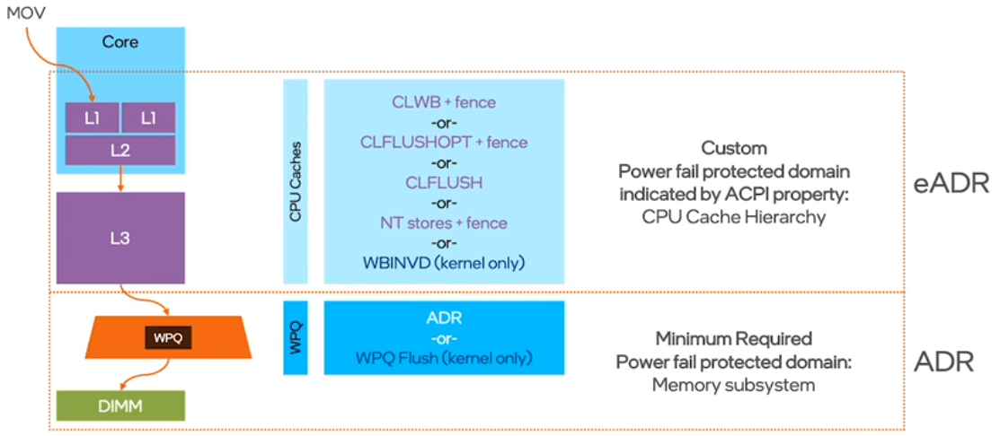

# What Is ADR?

持久内存 (PMem) 应用程序的挑战之一是并非系统中的所有内存层次结构都是持久的。今天支持 PMem 的系统必须具有称为异步 DRAM 刷新 (ADR) 的机制。 ADR 确保在断电期间，所有位于内存控制器的写挂起队列 (WPQ) 上的挂起写入都持久化 PMem。此外，ADR 将 DRAM 置于自刷新模式。鉴于一些非易失性双列直插内存模块 (NVDIMM) 由 DRAM 和闪存芯片组成，**自刷新**是确保 DRAM 中的数据在备份到**闪存**之前处于“安全”状态的关键。 

**由于 ADR 保护内存控制器但不考虑 CPU 缓存**，因此使用 ADR 的 PMem 编程不像常规（即易失性）编程那样直观。程序员必须确保在正确的时间以所需的顺序准确地刷新包含应该持久化的数据的缓存行。正确地做到这一点具有挑战性，并且可能会对性能产生影响。**第三代英特尔® 至强® 可扩展处理器支持的扩展 ADR (eADR) 通过确保 CPU 缓存也包含在所谓的“电源故障保护域”中来解决这个问题**。参见图 1。

对于 ADR，程序员必须使用任何可用指令（例如 CLWB 或 CLFLUSH）来确保数据是持久的。另一方面，使用 eADR 不需要flush，从而简化了 PMem 编程。

## Notes on Performance

（更多）

参考：<https://software.intel.com/content/www/us/en/develop/articles/eadr-new-opportunities-for-persistent-memory-applications.html>